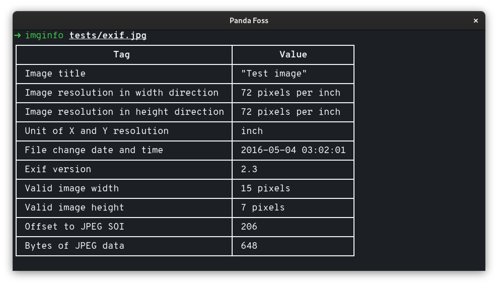
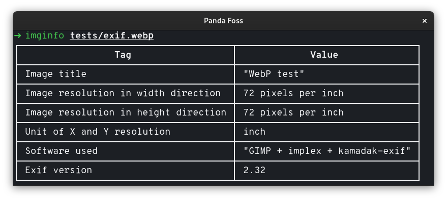
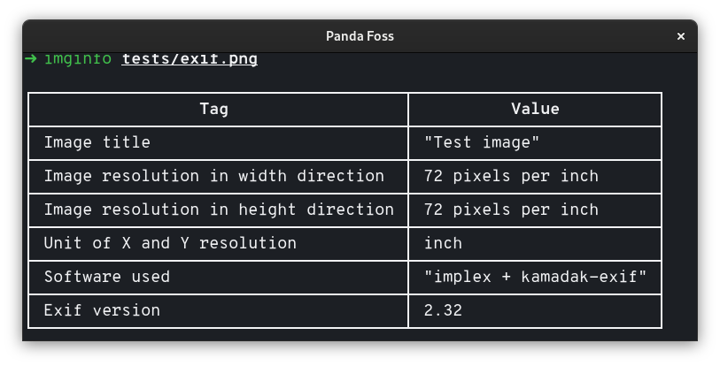

# imginfo
Display image EXIF data

## About

`imginfo` allows you to display EXIF data in an orderly fashion via the terminal.

Supported formats are:
   -  TIFF and some RAW image formats based on it
   -  JPEG
   -  HEIF and coding-specific variations including HEIC and AVIF
   -  PNG
   -  WebP

Note: It was created for educational purposes, so it may contain errors and its use is only recommended for recreational purposes. However, suggestions and PR are welcome.

### Examples

